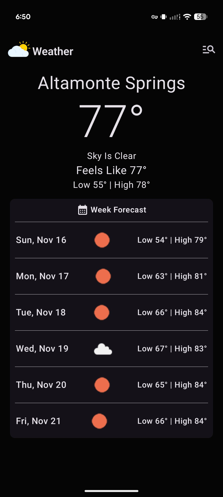
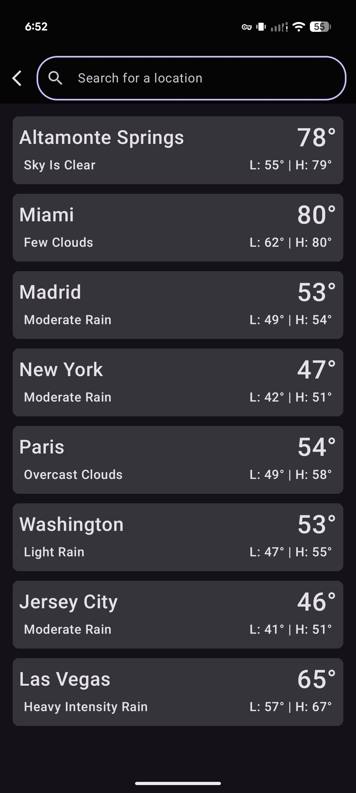
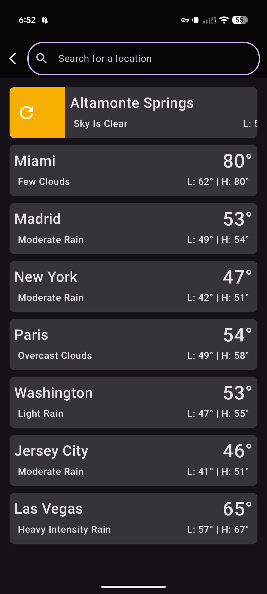
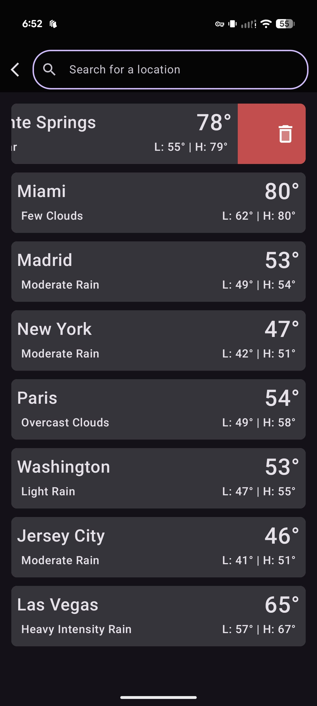
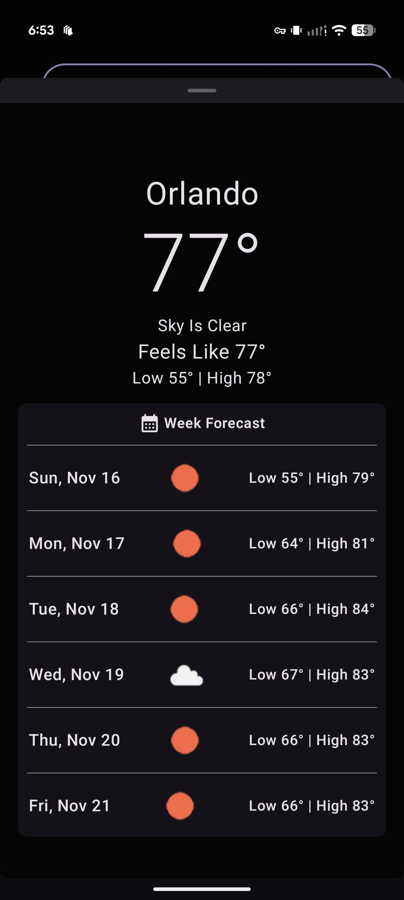
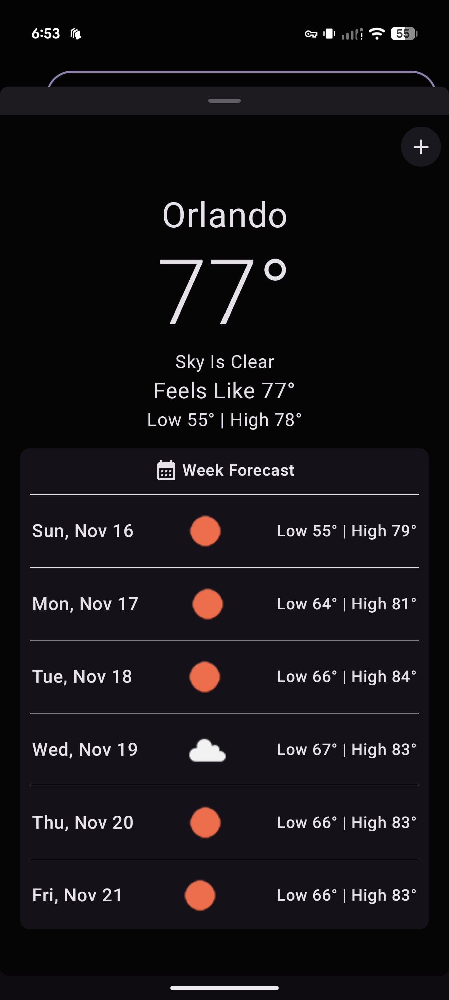

# Weather App

This is a weather application for Android, designed to provide real-time weather information using the [OpenWeather API](https://openweathermap.org/current). The app automatically detects the user's current location to deliver instant weather updates. Users also have the ability to search for and save other locations to easily access their weather forecasts. To optimize performance and minimize unnecessary API calls, the application uses a JSON document from OpenWeather to populate a local SQL database (Room) with all supported locations.

The application is built entirely with modern Android development practices, following the MVVM (Model-View-ViewModel) architecture. Its user interface is crafted with Jetpack Compose, and it leverages Kotlin Coroutines for managing background tasks and asynchronous data streams. Dependency injection is handled by Hilt, while local data persistence (such as saved locations) is managed through Room. Network requests to the weather data provider are made using Retrofit.

## Key Technologies

*   **Jetpack Compose:** The entire UI is built using Jetpack Compose, a modern toolkit for building native Android UI.
*   **Kotlin:** The app is written entirely in Kotlin.
*   **Coroutines and Flow:** Used for asynchronous operations and managing data streams.
*   **Hilt:** For dependency injection.
*   **Room:** For local data storage.
*   **Retrofit:** For making network requests to a weather API.
*   **Coil:** For image loading.
*   **Jetpack Navigation:** For navigating between screens.
*   **Material 3:** The app uses the Material 3 design system.
*   **Accompanist Permissions:** To simplify handling of runtime permissions.
*   **Google Play Services Location:** To get the device's location for weather data.

## Screenshots

### Main Screen
This is the primary view of the app, displaying the weather for the user's current location. It appears after the user grants location permission and serves as the main dashboard for weather information.

### Search Screen - Saved Locations View
This screen shows a list of all locations the user has previously saved. A prominent search bar at the top allows the user to look for new locations to get weather data for.

### Reload Swipe-Gesture
This demonstrates the swipe-to-refresh gesture on saved locations item. Since the app does not automatically sync data in the background to conserve API calls, users can manually trigger an update by swiping left to right. This fetches the latest weather information from the API for the displayed location.

### Delete Swipe-Gesture
This shows the swipe-to-delete functionality on the saved locations item. By swiping a saved location item from right to left, a user can easily remove it from their list.

### Location Modal - Saved Selection
When a user taps on a location from their saved list, this modal appears. It presents the full data of the current weather for that selected location, offering a quick-glance view without leaving the search screen.

### Search Screen - Search Location View
This view is displayed after a user types in the search bar. It shows a list of potential location matches from the local database, allowing the user to find and select the exact location they're interested in.

### Location Modal - Search Selection
After a user selects a location from the search results, this modal appears. It shows the current weather for the newly selected city and provides a button to save that location to their list for quick access in the future.

